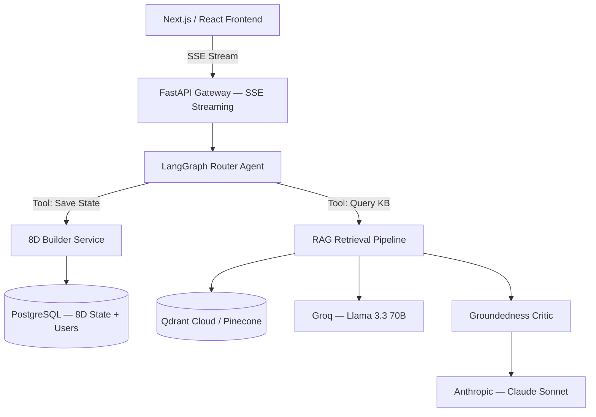

# Production Architecture Roadmap

## Overview

The current repository demonstrates a state-of-the-art **Advanced RAG Pipeline** — query expansion, LLM semantic enrichment, local cross-encoder reranking, multi-LLM orchestration, and eval-driven iteration. The implementation is production-grade in its patterns and architecture decisions, but uses a local-first stack (Gradio, Chroma, BGE on MPS) optimised for rapid development and evaluation rather than horizontal scaling.

This document describes the known gaps between the current portfolio implementation and a fully productionised enterprise system, and the phase-by-phase transition path.

---

## Current Stack — What It Is and Why

| Component | Current choice | Reason |
|---|---|---|
| UI | Gradio Blocks + streaming | Rapid iteration, built-in chat interface, zero frontend overhead |
| Vector store | Chroma (local) | Zero setup, persistent SQLite backing, sufficient for <10K chunks |
| Reranker | BAAI/bge-reranker-v2-m3 (local, MPS) | Free, no API dependency, ~2x better than embedding-only retrieval |
| Answer generation | GPT-4o-mini | Cost-effective, reliable instruction following, good on formal standards |
| Query rewriting | Claude Haiku 4.5 | Fast, precise JSON output, model diversity vs generator |
| Groundedness checker | Claude Haiku 4.5 | Independent perspective from generator, catches hallucinated claims |
| Observability | Langfuse | Trace-level debugging already implemented — production-ready pattern |
| State | `gr.State` (in-memory) | Sufficient for single-user demo; not suitable for multi-user production |

The multi-LLM stack (GPT-4o-mini generator + Haiku checker) is a deliberate architectural decision, not a cost oversight. Model diversity between generator and critic reduces self-leniency — a single model checking its own output has the same blind spots as when it generated it. Benchmark results confirm this: Llama 3.3 70B full-stack (same model for all three roles) scored -0.179 overall vs the mixed stack, with the largest drops on compliance-heavy content (-0.920 on `compliance` category).

---

## Target Production Architecture



---

## Phase 1 — API Layer (FastAPI + SSE)

**Problem:** Gradio's stateful process model is not suited for horizontal scaling. Every user session shares the same Python process. State lives in `gr.State` (in-memory, process-local). A pod restart loses all active 8D report state.

**Solution:**
- Replace Gradio backend with **FastAPI** — async, high-concurrency, production-standard
- Streaming via **Server-Sent Events (SSE)** using `StreamingResponse` — same token-by-token streaming as current Gradio implementation, but over a standard HTTP transport
- Move 8D Builder state from `gr.State` to **PostgreSQL** — each report gets a `report_id`, API accepts it per request, state is fully persistent and horizontally accessible
- Gradio UI can remain as a thin client calling the FastAPI backend — or be replaced with a React frontend

**What stays the same:** The entire RAG pipeline (`answer.py`) is already stateless — it takes a question and chunks and returns an answer. No changes needed to the core pipeline for Phase 1.

---

## Phase 2 — Infrastructure Decoupling

**Problem 1 — Local Chroma:** SQLite-backed Chroma cannot be shared across multiple pods. Each horizontal instance would need its own copy of the vector store, defeating the purpose of scaling.

**Solution:** Migrate to a managed vector store:
- **Qdrant Cloud** — open-source core, managed cloud option, strong filtering, good Python client
- **Pinecone** — managed-only, simpler ops, higher cost
- Migration is a one-time re-ingest — the ingest pipeline already produces clean embeddings and metadata. Point `chroma_dir` at a Qdrant collection instead.

**Problem 2 — Local BGE reranker:** `BAAI/bge-reranker-v2-m3` on MPS works for single-user demo but crashes under concurrent load (OOM on M1 8GB, documented in this project). Cannot be containerised in a standard CPU pod.

**Solution options (in order of preference):**
1. **Dedicated GPU microservice** — containerise BGE on a T4/A10 instance, expose as an internal API. Eliminates latency, handles concurrency
2. **Cohere Rerank v3.5** — managed API, no infrastructure overhead, strong benchmark performance. Cost: ~$0.001 per 1K tokens reranked. At 1,000 daily active users × 30 chunks reranked per query, ~$30/day
3. **Jina Reranker v3** — alternative to Cohere, 8K context window, cross-lingual support

---

## Phase 3 — Agentic Orchestration (LangGraph)

**Current state:** Static procedural pipeline — `rewrite → retrieve → rerank → answer → check`. Every query follows the same path regardless of intent.

**Target state:** Intent-aware router that selects the appropriate workflow based on the user's message.

**Router agent responsibilities:**
- Classify intent: KB question vs. 8D state read vs. 8D state write vs. ERP integration vs. out-of-scope
- For KB questions: route to RAG pipeline (current implementation)
- For 8D state questions: pull current `d_data_state` from PostgreSQL, include in context
- For 8D state writes: generate suggestion → user approves → write to PostgreSQL
- For ERP queries: call ERP API tool to fetch inventory, NCR status, supplier data

**Tool definitions (LangGraph):**
```python
tools = [
    read_8d_state(report_id),           # PostgreSQL read
    write_8d_discipline(report_id, d, content),  # PostgreSQL write
    query_knowledge_base(question),     # existing RAG pipeline
    query_erp_inventory(part_number),   # ERP API integration
    push_to_qms(report_id),            # QMS export
]
```

**State persistence:** LangGraph `SqliteSaver` for development, PostgreSQL checkpointer for production. Session state survives pod restarts.

**Model routing in the agentic layer:**
- Llama 3.3 70B via Groq for high-speed generation and synthesis (fast, cheap)
- Claude Sonnet for complex reasoning steps (orchestration decisions, multi-step tool use)
- Claude Haiku for JSON-constrained tasks (query rewriting, groundedness checking) — preserving model diversity

---

## Phase 4 — Automated KB Ingestion (DataOps)

**Problem:** SOPs and quality standards are living documents. Manual `--reset` re-ingest every time a document changes is not viable at scale. A stale KB produces stale answers — in a quality management context, this has compliance implications.

**Solution — CI/CD for knowledge:**

```yaml
# .github/workflows/kb_update.yml
on:
  push:
    paths:
      - 'knowledge-base/markdown/**.md'
jobs:
  reingest:
    steps:
      - name: Detect changed files
        run: git diff --name-only HEAD~1 HEAD -- knowledge-base/
      - name: Run targeted upsert
        run: uv run scripts/ingest.py --upsert --files $CHANGED_FILES
      - name: Run category eval
        run: uv run evaluation/eval.py --category $AFFECTED_CATEGORIES
      - name: Alert on score regression
        if: eval_score < threshold
        run: notify_slack("KB update caused eval regression")
```

Key design decisions:
- **Upsert, not reset** — only re-embed changed documents, preserve unchanged embeddings
- **Targeted eval** — run category eval on affected categories only, not full 197-question eval
- **Score gating** — block deployment if eval score drops below threshold
- **Soft-delete** — mark outdated chunks as inactive rather than hard-deleting, for audit trail

---

## Phase 5 — Enterprise Security and Governance

**Authentication:** OAuth2/OIDC integration (Entra ID for Microsoft-aligned enterprises, Okta for others). Corporate SSO — no separate credential management. JWT tokens per session.

**Role-Based Access Control (RBAC):**
- Every chunk in the vector store tagged with `tenant_id`, `division_id`, `classification_level`
- Metadata filtering at query time — users retrieve only chunks they are authorised to access
- A supplier quality engineer at Plant A cannot retrieve SOPs from Plant B
- An external auditor gets read-only access to approved document sets only

**Audit logging:**
- Every LLM interaction logged: user, question, retrieved chunks, answer, groundedness score
- Langfuse already captures this — extend with user identity and session metadata
- Compliance requirement for regulated industries (ISO 9001, IATF 16949, FDA 21 CFR Part 11)
- Immutable audit trail for any AI-assisted quality decision

**Data residency (GCC-specific):**
- UAE: data residency requirements for government and defense — G42 Cloud or Azure UAE North
- Saudi Arabia: Saudi Cloud Computing Company (SCC) or AWS Bahrain for KSA data
- All vector store and PostgreSQL deployments must comply with regional data sovereignty requirements
- Relevant for EDGE Group, Mubadala, PIF portfolio companies

---

## Known Gaps Summary

| Gap | Impact | Phase |
|---|---|---|
| Gradio stateful process | Cannot scale horizontally | 1 |
| `gr.State` in-memory | State lost on restart | 1 |
| Local Chroma | Not shareable across pods | 2 |
| BGE on MPS | OOM under concurrent load | 2 |
| Static pipeline | No intent routing | 3 |
| Manual KB updates | Stale knowledge risk | 4 |
| No authentication | No enterprise access control | 5 |
| No RBAC | No tenant isolation | 5 |
| No audit logging identity | Compliance gap | 5 |

**What is already production-grade in the current implementation:**
- RAG pipeline architecture (stateless, composable)
- LLM enrichment at ingest (headline + summary + practitioner queries)
- BGE cross-encoder reranking with graceful fallback
- Multi-LLM orchestration (generator + independent critic)
- Langfuse observability on every pipeline run
- Eval-driven development with 197-question test set
- Deterministic enrichment (temperature=0)
- Embedding space diagnostics (t-SNE + Sc heatmap)

---

*This document was written at portfolio project completion to explicitly map the gap between the current implementation and production requirements. The patterns are production-grade; the infrastructure is portfolio-grade. The transition path is well-defined.*
