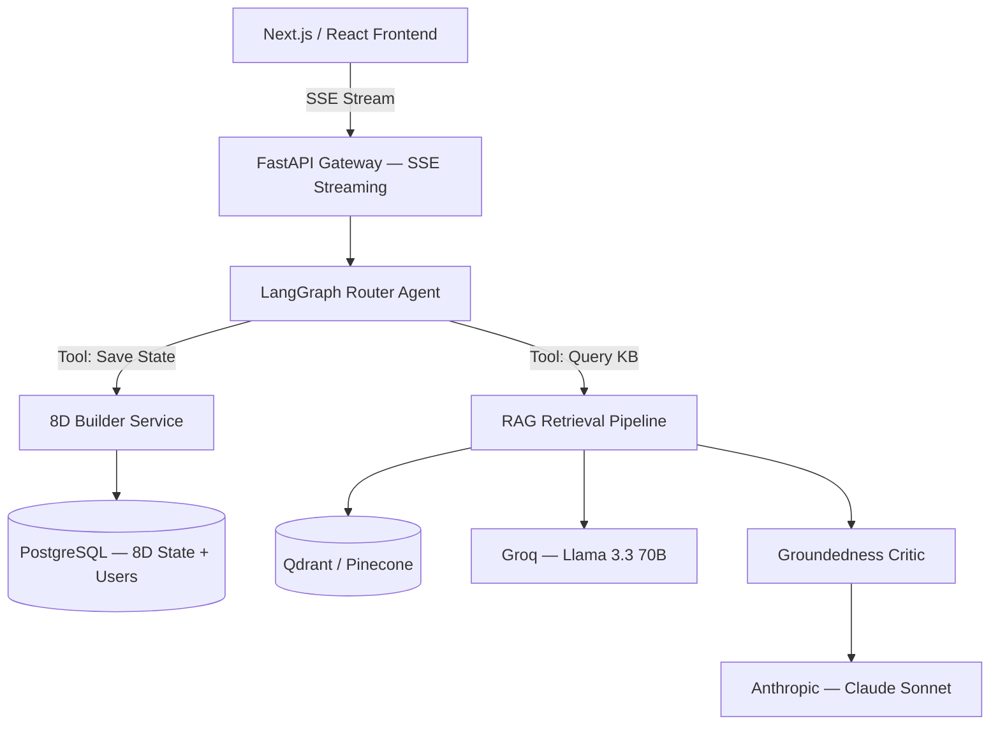

# 🔍 CAPA/8D Expert Knowledge Worker

An AI-powered expert assistant for quality engineers working with CAPA procedures, 8D problem-solving methodology, root cause analysis, FMEA, and industry compliance standards.

Built as a production-grade RAG pipeline with full evaluation framework, streaming UI, and Langfuse observability — not a demo.

---

## What it does

Quality engineers ask questions in natural language. The system retrieves the most relevant content from a curated knowledge base, reranks it with a local cross-encoder, generates a grounded expert answer, and strips any claims not supported by the retrieved context.

**Example questions it handles well:**
- *"Our containment sort found zero defects but the customer found three more — do we expand the suspect window?"*
- *"What are the IATF 16949 specific requirements for 8D?"*
- *"Why is calendar-based PM dangerous when production volume changes?"*
- *"Is it acceptable to close an 8D if the PCA relies 100% on operator retraining?"*
- *"The same defect has come back three times despite previous corrective actions — what now?"*
- *"My auditor says my D7 is just a paperwork exercise — what should it actually contain?"*
- *"What happens if the root cause literally cannot be verified because we can't recreate it in the lab?"*
- *"The customer rejected our 8D — how do I respond?"*

---

## Architecture

```
User question
     │
     ▼
Query Rewriting ── Claude Haiku generates 3 alternative phrasings (history-aware)
     │
     ▼
Retrieval ── text-embedding-3-small + Chroma (top 30 per query × 4 queries)
     │
     ▼
Merge & Deduplicate ── union across queries, deduplicated by chunk ID
     │
     ▼
Reranking ── BAAI/bge-reranker-v2-m3 (local, MPS/CUDA/CPU)
     │         fallback: Claude Haiku LLM reranker
     ▼
Answer Generation ── GPT-4o-mini with conversation history
     │
     ▼
Groundedness Check ── Claude Haiku strips ungrounded claims
     │
     ▼
Expert answer with inline source citations
```

**Stack:**

| Component | Model / Tool |
|---|---|
| Query rewriting | Claude Haiku (`claude-haiku-4-5`) |
| Embeddings | `text-embedding-3-small` (OpenAI) |
| Vector store | Chroma (persistent, local) |
| Reranker | `BAAI/bge-reranker-v2-m3` (HuggingFace, local) |
| Answer generation | `gpt-4o-mini` (OpenAI) |
| Groundedness check | Claude Haiku |
| Observability | Langfuse (traces per pipeline run) |
| UI | Gradio 5.x / 6.x (streaming) |

---

## Knowledge Base

14 enriched documents, ~35,000 words, covering:

| Document | Category | Coverage |
|---|---|---|
| `8D_problem_solving_methodology.md` | methodology | D0–D8 complete guide, timing norms, common mistakes |
| `8D_report_example_automotive.md` | example | Steering bracket bore defect — full worked example with FINDING-anchored QR section |
| `8D_report_example_semiconductor.md` | example | IC wirebond failure — SEM/EDX analysis with FINDING-anchored QR section |
| `CAPA_SOP_enriched.md` | procedure | ISO 9001 Clause 10.2, CAPA ID format, VoE criteria |
| `containment_decision_guide.md` | procedure | Full location table, ICA methods, removal logic |
| `control_plan_basics.md` | reference | Column-by-column guide, 25% volume change rule |
| `effectiveness_verification_guide.md` | procedure | VoE metrics by CA type, Cpk thresholds |
| `fmea_basics.md` | reference | S/O/D/RPN, AIAG-VDA AP, material substitution rules + practitioner Q&A |
| `is_is_not_analysis.md` | tool | Template + 2 worked examples + practitioner Q&A |
| `multi-industry_CAPA_8D_compliance.md` | compliance | ISO 9001, IATF 16949, AS9100, ISO 13485, Semiconductor |
| `rca_tool_selection_matrix.md` | tool | 5 Whys/Ishikawa/FTA routing logic + unverifiable root cause guide |
| `root_cause_analysis.md` | tool | 5 Whys + Ishikawa toolkits, systemic vs local distinction |
| `capa_edge_cases.md` | general | Edge cases: ICA failure, containment pressure, long-running CAPAs, untraceable suspects |
| `8d_practitioner_scenarios.md` | general | Internal/customer/supplier rejections, daily updates, speed vs thoroughness |

---

## Evaluation

Evaluated against **197 test questions** across 3 independent sources:
- **t001–t050**: Developer-written structured questions with expected sources
- **t051–t197**: Blind questions from Gemini Pro and ChatGPT (practitioner-phrased)

### Important note on MRR

The eval framework calculates MRR only for questions with `expected_sources` defined. Of 197 questions, 48 structured questions (t001–t048) have expected sources — the remaining 149 blind questions (t051–t197) have `expected_sources=[]` and always score MRR=0 by design. The headline MRR figure (0.198–0.203) is therefore not a retrieval quality metric — it is a structural artefact of the eval design. The meaningful retrieval metric is MRR on structured questions only (~0.80–0.92 depending on run). Judge scores (correctness, completeness, groundedness) are valid across all 197 questions.

### Full 197-question eval — four runs compared

| Metric | Baseline (Apr 20) | FINDING anchors (Apr 21) | Guardrails + Markdown (Apr 24) | Final (Apr 25) | vs Baseline |
|---|---|---|---|---|---|
| Judge — Overall | 6.926 | 6.774 | 7.094 | **7.121** | **+0.195** ✅ |
| Judge — Correctness | 7.412 | 7.246 | 7.426 | **7.441** | +0.029 → |
| Judge — Completeness | 6.268 | 6.149 | 6.369 | **6.467** | **+0.199** ✅ |
| Judge — Groundedness | 7.098 | 6.928 | 7.487 | **7.456** | **+0.358** ✅ |
| Mean top chunk score | 4.049 | 4.048 | 5.120 | **4.424** | **+0.375** ✅ |
| Source coverage rate | 99.0% | 96.9% | 95.9% | 96.4% | -2.6% → |
| Checker score | 0.665 | 0.651 | 0.636 | **0.671** | +0.006 → |

### By category — full iteration history

| Category | Baseline | Apr 21 | Apr 24 | **Final (Apr 25)** | vs Baseline |
|---|---|---|---|---|---|
| containment | 7.620 | 7.350 | 7.260 | **8.200** | **+0.580** ✅ |
| compliance | 6.710 | 6.730 | 7.040 | **7.250** | **+0.540** ✅ |
| mixed | 6.360 | 6.560 | 6.920 | **6.920** | **+0.560** ✅ |
| example | 4.670 | 6.330 | 6.420 | **6.250** | **+1.580** ✅ |
| RCA | 7.620 | 7.370 | 7.980 | **7.910** | **+0.290** ✅ |
| edge_case | 7.110 | 7.030 | 6.580 | **7.250** | **+0.140** ✅ |
| 8D_methodology | 6.670 | 6.860 | 6.880 | **6.710** | +0.040 → |
| CAPA_procedure | 6.050 | 5.650 | 6.240 | **6.050** | 0.000 → |
| VoE | 6.970 | 6.610 | 6.700 | **6.740** | -0.230 ❌ |
| FMEA | 6.840 | 6.180 | 7.350 | **6.590** | -0.250 ❌ |
| enriched_content | 8.220 | 7.890 | 8.670 | **7.670** | -0.550 ❌ |

### Model benchmark — GPT-4o-mini + Haiku vs Llama 3.3 70B full-stack (Groq)

Same 197-question test set, same BGE reranker, same Sonnet 4.5 judge. Only variable: answer generation + query rewriting + groundedness checker.

| Metric | GPT-4o-mini + Claude Haiku | Llama 3.3 70B (Groq, full-stack) | Delta |
|---|---|---|---|
| Overall | **7.121** | 6.942 | -0.179 |
| Correctness | **7.441** | 7.323 | -0.118 |
| Completeness | **6.467** | 6.205 | -0.262 |
| Groundedness | **7.456** | 7.297 | -0.159 |
| Checker score | **0.671** | 0.590 | -0.081 |
| Median latency | ~28s | **~32s** | +4s |
| Est. cost / 197q | ~$2.50 | **~$1.20** | -52% |

**Category winners:**

| Category | Winner | Delta |
|---|---|---|
| compliance | GPT-4o-mini +Haiku | +0.920 |
| enriched_content | GPT-4o-mini + Haiku | +0.890 |
| containment | GPT-4o-mini + Haiku | +0.500 |
| VoE | Llama 3.3 70B | +0.230 |
| 8D_methodology | Llama 3.3 70B | +0.180 |

**Key findings:**
- Llama 3.3 70B is 52% cheaper and competitive on general methodology questions
- GPT-4o-mini + Haiku wins significantly on compliance-heavy and enriched content categories — formal standards vocabulary (ISO, IATF clause language) favours GPT-4o-mini
- Llama's checker is stricter on its own output (checker_score 0.590 vs 0.671) — no self-leniency detected. The groundedness drop is real generation quality, not false confidence
- **Recommendation for production:** Llama 3.3 70B as generator with Claude Haiku as rewriter/checker (preserving model diversity) is the next benchmark to run. Expected to recover most of the compliance gap while retaining the cost advantage

*Note: latency measured on M1 8GB with shared memory pressure during eval. Median is the reliable metric — max latency (1698s) reflects OS competition for unified memory, not model performance.*

### Example category iteration (4 questions, tracked separately)

| Run | Overall | MRR | top_chunk | t015 | t019 | t030 | t038 | Notes |
|---|---|---|---|---|---|---|---|---|
| Baseline | 4.25 | 0.750 | 6.74 | 7.0 | 4.0 | 4.0 | 2.0 | No QR section |
| + QR section | 6.58 | 0.750 | 6.74 | 7.7 | 3.7 | 9.3 | 5.7 | Upsert only, no reset |
| + category map change | 5.50 | 0.542 | 5.56 | 7.0 | 4.0 | 8.0 | 3.0 | --reset broke embeddings |
| + FACTUAL RECALL RULE | 4.83 | 0.473 | 5.56 | 5.7 | 4.3 | 7.3 | 2.0 | Answer prompt change backfired |
| Partial revert | 5.33 | 0.442 | 5.56 | 4.3 | 6.0 | 7.0 | 4.0 | FACTUAL RECALL still active |
| + FINDING anchors + temp=0 | 6.58 | 0.875 | 7.96 | 7.3 | 3.3 | 8.7 | 7.0 | Stable deterministic baseline |
| + Guardrails + Markdown | **7.42** | **1.000** | **7.28** | 6.3 | 5.3 | 8.0 | **10.0** | New best — MRR perfect |

---

## Key Engineering Decisions

**1. LLM-enriched chunking**
Each chunk is enriched at ingest with a Claude Haiku-generated headline and summary. Embedding = `headline + summary + original_text`. Improves retrieval for questions phrased differently from source material.

**2. BGE cross-encoder reranking**
`BAAI/bge-reranker-v2-m3` runs locally (free, no API). Reranks 40–120 merged candidates to 15. ~2s after warmup. Falls back to Claude Haiku if torch not installed. RETRIEVAL_K=30 for broader candidate pool.

**3. Groundedness post-checker**
After answer generation, Claude Haiku audits each claim against retrieved chunks and strips anything ungrounded. Only fires when top BGE score ≥ 0.5 — skips pure synthesis queries where claim-level checking is too aggressive.

**4. Streaming UI**
Expert Q&A tab streams tokens as they arrive. Sources panel populates from retrieval sink before first token — no second API call needed. Gradio 6.x compatible.

**5. Langfuse observability**
Every pipeline run traced with child spans: `rewrite_query`, `bge_rerank`, `generate_answer`, `groundedness_check`. Latency, chunk scores, checker scores, and source metadata logged per question.

**6. Three-source test set**
197 questions built from three independent sources to prevent eval overfitting. External questions are practitioner-phrased with no knowledge of document structure.

**7. Deterministic enrichment (temperature=0)**
Claude Haiku enrichment calls run at `temperature=0`. This ensures every re-ingest produces identical headlines for identical chunk text, making eval results comparable across runs. Discovered after multiple regressions caused by non-deterministic headline generation at the default `temperature=1.0`.

**8. FINDING-anchored QR sections**
Worked example documents contain a Quick Reference section prepended before the full case record. Each QR entry begins with a `FINDING:` line — a single factual sentence with CAPA ID, part number, and key numbers. At `temperature=0`, Haiku uses this line as the chunk headline, producing specific embeddings that resist retrieval competition from semantically adjacent general guidance documents.

---

## Engineering Post-Mortem: What Broke and What We Learned

This section documents the iteration cycle on the `example` category — from a baseline of 4.25/10 to a stable 6.58/10 with MRR improving from 0.750 to 0.875. It is included because the debugging process produced more durable engineering knowledge than the initial build.

### Problem 1 — Retrieval competition from semantically adjacent documents

**What happened:** After adding `capa_edge_cases.md` and `8d_practitioner_scenarios.md` to the KB, factual questions about worked examples began returning wrong answers. The question "What did the automotive 8D team find when they did the lateral search in D7?" scored 2.0/10 despite the correct document being retrieved.

**Diagnosis via Langfuse:** Traces showed `8d_practitioner_scenarios__chunk_0004` scoring 3.08 in BGE reranking vs the correct automotive example chunk at 2.82. The practitioner scenarios document discusses D7 lateral search as general guidance, using nearly identical vocabulary to the factual case record. BGE cannot distinguish "here's what the team found" from "here's what a team should look for" when vocabulary is the same.

**Diagnosis via t-SNE:** Embedding space visualization showed `general` category chunks scattered throughout `example` category space — direct visual evidence of the retrieval competition. Quantified from the HTML data: `general` centroid spread = 7.00 (highest of any category), `example` centroid at (7.98, -11.84) vs `general` centroid at (-3.92, -1.14), centroid distance = 16.00. Despite this macro-level separation, 4 out of 23 `general` chunks (17%) were within distance 5 of an example chunk — the exact stragglers causing retrieval interference. **This visualization would have immediately identified the problem had it been run after the KB change, before running the 2-hour eval. It is now part of the iteration checklist.**

**Fix attempted — wrong:** Changed `doc_category` for the new documents in `ingest.py`, triggered `--reset` re-ingest. This forced Haiku to re-enrich all chunks at `temperature=1.0` (default), producing different headlines for all documents including the automotive example. MRR dropped from 0.750 to 0.542. **Lesson: never use `--reset` when enrichment is non-deterministic — it destroys working embeddings.**

**Fix attempted — wrong:** Added a `CRITICAL — FACTUAL RECALL RULE` to the answer generation system prompt. This caused GPT-4o-mini to over-apply the instruction to questions where the top-ranked chunk was methodology content rather than case content, making unrelated answers worse. Semiconductor corrective actions (t015) dropped from 7.7 → 4.3 despite perfect retrieval. **Lesson: broad prompt instructions have unpredictable side effects across all query types.**

**Fix that worked:** FINDING anchor lines added to QR section entries in worked example documents. Each `FINDING:` line is a single specific sentence with CAPA ID, part number, and key numbers. Combined with `temperature=0` on enrichment, Haiku reliably generates this as the chunk headline — producing embeddings specific enough to score higher than general guidance chunks for case-specific queries.

**t-SNE before vs after FINDING anchors:**

| Category | Spread (before) | Spread (after) | example centroid distance (after) |
|---|---|---|---|
| example | scattered, no cluster | 4.98 | — |
| general | everywhere | 6.04 | **21.25** |
| tool | moderate | 6.80 | 19.92 |
| procedure | scattered | 8.64 | 17.85 |
| compliance | moderate | 3.37 | 18.57 |
| reference | isolated | 4.21 | 11.84 |
| methodology | moderate | 7.68 | 13.47 |

`general` chunks within distance 5 of `example`: **0/28 (0%)** — down from 17% in the previous run. FINDING anchors + CHUNK_SIZE=400 eliminated cross-category contamination entirely.

---

### Cosine Similarity (Sc) analysis

Run with `sc_viz.py` (see Diagnostics section). Two outputs: intra-category violin plot and cross-category heatmap.

**Intra-category Sc — how coherent each category is internally:**

| Category | N chunks | Mean Sc | Interpretation |
|---|---|---|---|
| compliance | 20 | **0.680** | Tightest — ISO/IATF docs share dense vocabulary |
| methodology | 15 | 0.661 | Good — 8D disciplines share framework vocabulary |
| example | 29 | 0.657 | Good — automotive + semiconductor share CAPA vocabulary |
| reference | 27 | 0.624 | Moderate — FMEA and control plan related but distinct |
| tool | 55 | 0.621 | Moderate — RCA tools share methods |
| general | 28 | 0.610 | Lower — practitioner scenarios cover broad topics |
| procedure | 34 | **0.588** | Most scattered — containment, CAPA SOP, VoE are procedurally distinct |

**Cross-category competition risks (from heatmap):**

| Category A | Category B | Mean Sc | Risk |
|---|---|---|---|
| compliance | compliance (intra) | 0.680 | Healthy diagonal |
| compliance | example | **0.656** | ⚠️ Highest risk — IATF D7/PFMEA content overlaps automotive example D7 |
| methodology | methodology (intra) | 0.661 | Healthy diagonal |
| general | procedure | 0.610 | Moderate — practitioner scenarios overlap procedural guidance |
| example | general | **0.502** | ✅ Low — FINDING anchors successfully separated these categories |

The `compliance ↔ example` risk (0.656) is the highest competition risk in the current KB. IATF 16949 requirements for D7 FMEA updates share vocabulary with the automotive worked example's D7 section. Not yet causing eval failures but monitored. The `example ↔ general` Sc of 0.502 confirms the FINDING anchor fix worked at the embedding level — the two categories that caused retrieval failures are now the least similar pair in the KB.

---

### Problem 2 — Non-deterministic enrichment making eval results non-comparable

**Root cause:** `client.messages.create()` in `enrich_chunk()` was called without `temperature`. Anthropic API default is `temperature=1.0`. Different Haiku runs generated different headlines for identical text, producing different `embed_text` values, different embeddings, and different BGE rankings. Eval scores were measuring a combination of KB quality and enrichment randomness — you could not reliably attribute score changes to KB changes.

**Fix:** `temperature=ENRICHMENT_TEMP` (=0) added to the enrichment API call. One line change. Every future re-ingest now produces identical results for identical content.

**Lesson:** Any LLM call that feeds a deterministic downstream process (embeddings, structured extraction, classification) must run at `temperature=0`. Reserve `temperature > 0` for user-facing generation where variation is acceptable.

---

### Problem 3 — Chunk boundary shifting when documents are modified

**What happened:** Adding the QR section (~800 words) to the top of the automotive example document shifted all chunk boundaries for the entire document. body chunks (D4, D7, etc.) got new text boundaries, new headlines, and new embeddings. The eval score that worked before the QR addition could not be reproduced after a `--reset` ingest — even with the QR section present — because the body chunk embeddings were now different.

**Why RUN2 (first QR addition) scored well:** It used plain `upsert` (no `--reset`), which added new QR chunks while preserving the original body chunk embeddings. Every subsequent `--reset` destroyed those preserved embeddings.

**Fix:** The FINDING anchors make body chunk quality less dependent on lucky headline generation — they anchor the most retrieval-critical content explicitly. Combined with `temperature=0`, the ingest is now stable regardless of chunk boundary position.

**Lesson:** In a RAG pipeline, document modifications are not free — they can degrade retrieval for content you didn't touch. Use incremental upsert for additions. Use `--reset` only when you explicitly want to rebuild all embeddings.

---

### Iteration checklist (derived from the above)

After any KB change:
1. `uv run scripts/ingest.py --reset` (only if structural changes — otherwise upsert)
2. `uv run scripts/diagnostics/tsne_viz.py` — check for category bleeding before running eval
3. `uv run scripts/diagnostics/sc_viz.py` — check intra-category coherence and cross-category competition risks
4. `uv run evaluation/eval.py --category [affected_category]` — fast category check
5. Only if category eval is clean: `uv run evaluation/eval.py` — full 197-question eval

---

### Known limitations

**`enriched_content` regression — unresolved**
enriched_content dropped from 8.670 (Apr 24) to 7.670 (Apr 25 final). These are the hand-enriched documents that previously scored highest. The new KB additions (containment practitioner scenarios, synthetic query enrichment across all documents) may be competing with them. Root cause not yet diagnosed. Next investigation: Sc per-query analysis on enriched_content questions to identify which categories are competing.

**VoE and FMEA — below baseline**
VoE: 6.970 baseline → 6.740 final (-0.230). FMEA: 6.840 baseline → 6.590 final (-0.250). Both have stable MRR — retrieval is not the issue. Generation quality regressions from re-ingest headline changes. Mitigation: further ANSWER_SYSTEM tightening for sequential/technical content.

**t019 (5 Whys walk-through) — completeness gap**
MRR=1.0, top_chunk=9.71 (perfect retrieval), judge overall=5.3. Checker score 0.28 — the checker is still stripping content. The markdown chunking improved this from 3.3 to 5.3 but completeness remains below target. Root cause: GPT-4o-mini partially summarises the chain despite the sequential process instruction. Next fix: stronger sequential reproduction instruction with explicit chain format example.

**`general` category structural overlap — resolved**
Previous runs showed 17% of general chunks within distance 5 of example chunks. Final state: 0% overlap confirmed by t-SNE (0 stragglers) and Sc heatmap (example ↔ general mean Sc = 0.527 — lowest cross-category pair).

**compliance ↔ example retrieval competition — resolved**
Previous Sc 0.656 (high risk). Post-synthetic query enrichment: 0.562 (resolved). IATF 16949 D7/PFMEA content no longer competes meaningfully with automotive example D7 chunks.

---

## Setup

### Prerequisites
- Python 3.11+
- [uv](https://docs.astral.sh/uv/)
- OpenAI API key + Anthropic API key
- Langfuse account (free) + project keys

### Install
```bash
git clone https://github.com/kolmag/capa-8d-expert.git
cd capa-8d-expert
uv sync
```

Create `.env`:
```
OPENAI_API_KEY=sk-...
ANTHROPIC_API_KEY=sk-ant-...
LANGFUSE_PUBLIC_KEY=pk-lf-...
LANGFUSE_SECRET_KEY=sk-lf-...
LANGFUSE_HOST=https://cloud.langfuse.com
```

### Optional: BGE reranker
```bash
uv add torch transformers
# Model downloads on first run (~570MB)
```

### Build knowledge base
Provide your own `.md` documents in `knowledge-base/markdown/`, then:
```bash
uv run scripts/ingest.py --reset
```

### Run
```bash
uv run scripts/app.py
# Open http://localhost:7860
```

---

## Evaluation commands

```bash
# Full 197-question eval (~2-3 hours)
uv run evaluation/eval.py --tests evaluation/tests_v3.jsonl

# Quick sample — 20 random questions
uv run evaluation/eval.py --tests evaluation/tests_v3.jsonl --sample 20

# By category
uv run evaluation/eval.py --tests evaluation/tests_v3.jsonl --category RCA
```

---

## Diagnostics

```bash
# t-SNE embedding space visualization — run after every re-ingest
uv run scripts/diagnostics/tsne_viz.py \
    --db_path ./chroma_db \
    --collection capa_8d_expert \
    --dims 2

# Cosine similarity analysis — intra-category coherence + cross-category competition
uv run scripts/diagnostics/sc_viz.py \
    --db_path ./chroma_db \
    --collection capa_8d_expert

# Sc with per-query analysis (embeds 20 sample questions, shows retrieval competition)
uv run scripts/diagnostics/sc_viz.py \
    --db_path ./chroma_db \
    --collection capa_8d_expert \
    --queries evaluation/tests_v3.jsonl \
    --n_queries 20
```

---

## Project Structure

```
capa-8d-expert/
├── scripts/
│   ├── ingest.py              # Chunking, LLM enrichment, Chroma ingestion
│   ├── answer.py              # RAG pipeline (rewrite→retrieve→rerank→answer→check)
│   ├── app.py                 # Gradio UI (Expert Q&A)
│   └── diagnostics/
│       └── tsne_viz.py        # Embedding space visualization
├── evaluation/
│   ├── eval.py                # MRR + LLM-as-judge pipeline
│   └── tests_v3.jsonl         # 197 test questions (3 sources)
├── knowledge-base/
│   └── markdown/              # 14 enriched source documents
├── .env.example
└── pyproject.toml
```

---

## Production Architecture Roadmap

This repository is a portfolio implementation demonstrating production-grade RAG patterns. The current stack (Gradio, local Chroma, local BGE) is optimised for rapid iteration and eval-driven development — not for horizontal scaling. This section documents the known gaps and the transition path to a fully production-ready system.



### Phase 1 — API Layer (FastAPI)
Replace Gradio's stateful process with a RESTful FastAPI backend. Streaming via Server-Sent Events (SSE). Move 8D Builder state from `gr.State` (in-memory) to PostgreSQL — accept `report_id` per request for stateless horizontal scaling.

### Phase 2 — Infrastructure
Migrate from local Chroma to managed vector store (Qdrant Cloud or Pinecone) to decouple embeddings from compute. Offload BGE reranker to a dedicated GPU microservice or replace with Cohere Rerank v3.5 managed API — eliminates the M1/8GB RAM constraint entirely.

### Phase 3 — Agentic Orchestration (LangGraph)
Transition from the current static pipeline (`answer.py`) to a stateful multi-actor system. Router agent evaluates intent: KB question vs. 8D state read/write vs. ERP integration. Tool calling for database reads/writes, QMS push, and ERP inventory queries. Model routing: Llama 3.3 70B via Groq for generation, Claude Haiku for JSON-constrained tasks (query rewriting, groundedness checking).

### Phase 4 — Automated KB Ingestion
SOPs are living documents. CI/CD for knowledge: GitHub Action or Airflow DAG triggered on document updates. Pipeline: parse updated Markdown → Haiku semantic enrichment → embed → upsert to vector store (soft-delete outdated chunks). KB stays current without manual re-ingest.

### Phase 5 — Enterprise Security
OAuth2/OIDC (Entra ID, Okta) for corporate SSO. RBAC with metadata filtering at the vector store level — every chunk tagged with `tenant_id` and `division_id`, ensuring users retrieve only authorised SOPs. Audit logging on all LLM interactions for compliance traceability.

**Current portfolio limitations vs. production requirements:**

| Concern | Current (Portfolio) | Production |
|---|---|---|
| State persistence | `gr.State` (in-memory) | PostgreSQL + `report_id` |
| Vector store | Local Chroma | Qdrant Cloud / Pinecone |
| Reranker | Local BGE (OOM on M1 8GB) | Dedicated GPU microservice / Cohere API |
| Scaling | Single process, Gradio | FastAPI + horizontal pods |
| Auth | None | OAuth2/OIDC + RBAC |
| KB updates | Manual `--reset` ingest | CI/CD triggered auto-ingest |
| Observability | Langfuse (implemented) | Langfuse + alerting on score degradation |


*Built as part of an AI engineering portfolio. The engineering post-mortem above documents the full iteration cycle — baseline, regressions, root cause analysis, and fixes. Evaluation-driven development: every KB change is measured against a 197-question test set before committing.*
